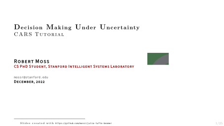

# MDP/POMDP tutorial for CARS
Center for [Automotive Research at Stanford (CARS)](https://cars.stanford.edu/) tutorial on decision making under uncertainty by [Robert Moss](https://github.com/mossr). Based on lectures from [Julia Academy](https://juliaacademy.com/p/decision-making-under-uncertainty-with-pomdps-jl).

<kbd>

  

</kbd>